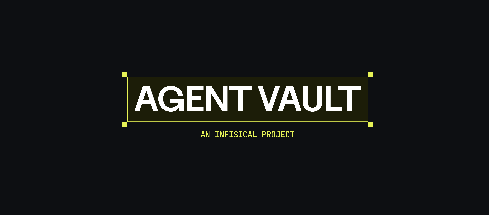

<p align="center">
  
</p>

<p align="center"><strong>Authenticated HTTP Proxy and Vault for AI Agents</strong></p>

<p align="center">
An open-source credential broker by <a href="https://infisical.com">Infisical</a> that sits between your agents and the APIs they call.<br>
Agents should not possess credentials. Agent Vault eliminates credential exfiltration risk with brokered access.
</p>

<p align="center">
<a href="https://docs.agent-vault.dev">Documentation</a> | <a href="https://docs.agent-vault.dev/installation">Installation</a> | <a href="https://docs.agent-vault.dev/reference/cli">CLI Reference</a> | <a href="https://infisical.com/slack">Slack</a>
</p>

## Why Agent Vault

Secret managers return credentials directly to the caller. This breaks down with AI agents, which are non-deterministic systems vulnerable to prompt injection that can be tricked into exfiltrating secrets.

Agent Vault takes a different approach: **Agent Vault never reveals vault-stored credentials to agents**. Instead, agents route HTTP requests through a local proxy that injects the right credentials at the network layer.

- **Brokered access, not retrieval** - Your agent gets a token and a proxy URL. It sends requests to `proxy/{host}/{path}` and Agent Vault authenticates them. Credentials stored in the vault are never returned to the agent. [Learn more](https://docs.agent-vault.dev/learn/security)
- **Works with any agent** - Custom Python/TypeScript agents, sandboxed processes, coding agents (Claude Code, Cursor, Codex), anything that can make HTTP requests. [Learn more](https://docs.agent-vault.dev/quickstart)
- **Self-service access** - Agents discover available services at runtime and [propose access](https://docs.agent-vault.dev/learn/proposals) for anything missing. You review and approve in your browser with one click.
- **Encrypted at rest** - Credentials are encrypted with AES-256-GCM using an Argon2id-derived key. The master password never touches disk. [Learn more](https://docs.agent-vault.dev/learn/credentials)
- **Multi-user, multi-vault** - Role-based access control with instance and vault-level [permissions](https://docs.agent-vault.dev/learn/permissions). Invite teammates, scope agents to specific [vaults](https://docs.agent-vault.dev/learn/vaults), and audit everything.

<p align="center">
  
</p>

## Installation

See the [installation guide](https://docs.agent-vault.dev/installation) for full details.

### Script (macOS / Linux)

Auto-detects your OS and architecture, downloads the latest release, and installs. Works for both fresh installs and upgrades (backs up your database before upgrading).

```bash
curl -fsSL https://raw.githubusercontent.com/Infisical/agent-vault/main/install.sh | sh
```

Supports macOS (Intel + Apple Silicon) and Linux (x86_64 + ARM64).

### [Docker](https://docs.agent-vault.dev/self-hosting/docker)

```bash
docker run -it -p 14321:14321 -p 14322:14322 -v agent-vault-data:/data infisical/agent-vault
```

Port `14322` exposes the transparent HTTPS proxy (on by default) — omit the mapping or pass `--mitm-port 0` to the server if you only need the explicit `/proxy/{host}/{path}` API on `14321`.

### From source

Requires [Go 1.25+](https://go.dev/dl/) and [Node.js 22+](https://nodejs.org/).

```bash
git clone https://github.com/Infisical/agent-vault.git
cd agent-vault
make build
sudo mv agent-vault /usr/local/bin/
```

## Quickstart

### 1. Start the server

```bash
agent-vault server -d
```

### 2. Add a credential and service

```bash
agent-vault vault credential set GITHUB_TOKEN=ghp_xxx
agent-vault vault service add --host api.github.com --auth-type bearer --token-key GITHUB_TOKEN
```

### 3. Connect an agent

#### Coding agents (Claude Code, Cursor, Codex)

```bash
agent-vault vault run -- claude
```

#### Sandboxed agents (Docker, Daytona, E2B)

```typescript
import { AgentVault, buildProxyEnv } from "@infisical/agent-vault-sdk";

const av = new AgentVault({ token: "YOUR_TOKEN", address: "http://localhost:14321" });
const session = await av.vault("default").sessions.create({ vaultRole: "proxy" });
const env = buildProxyEnv(session.containerConfig!, "/etc/ssl/agent-vault-ca.pem");
// Pass env + session.containerConfig.caCertificate to your container runtime
```

#### CLI

```bash
export AGENT_VAULT_SESSION_TOKEN=$(agent-vault vault token)
curl https://api.github.com/user/repos  # routed through Agent Vault automatically
```

The agent never sees credentials. Agent Vault intercepts HTTPS traffic via its transparent proxy, matches the host, and injects the right credential before forwarding upstream.

If a service isn't configured yet, the agent can [propose access](https://docs.agent-vault.dev/learn/proposals) — you approve in the web UI at `http://localhost:14321` and the agent retries.

### SDK

```bash
npm install @infisical/agent-vault-sdk
```

See the [TypeScript SDK README](sdks/sdk-typescript/README.md) for full documentation.

## Development

```bash
make build      # Build frontend + Go binary
make test       # Run tests
make web-dev    # Vite dev server with hot reload (port 5173)
make dev        # Go + Vite dev servers with hot reload
make docker     # Build Docker image
```

---

> **Preview.** Agent Vault is in active development and the API is subject to change. Please review the [security documentation](https://docs.agent-vault.dev/learn/security) before deploying.
